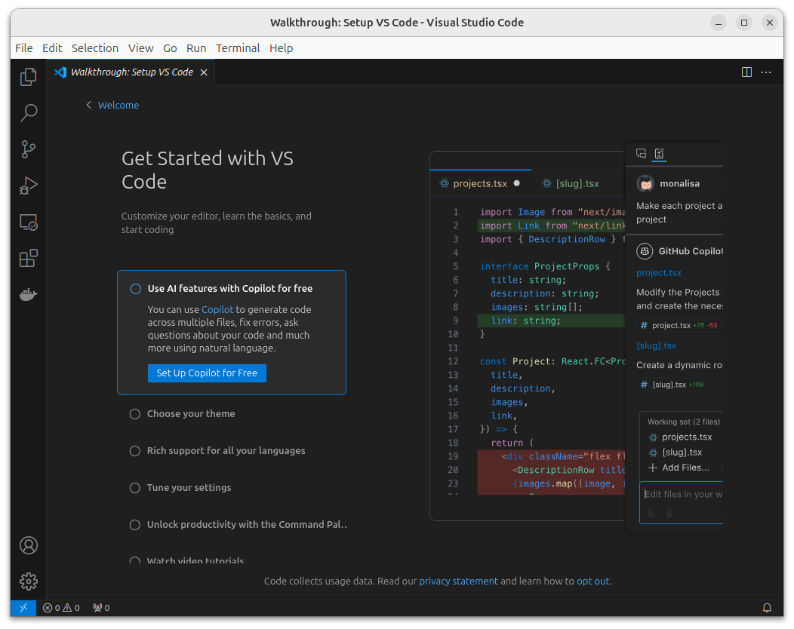
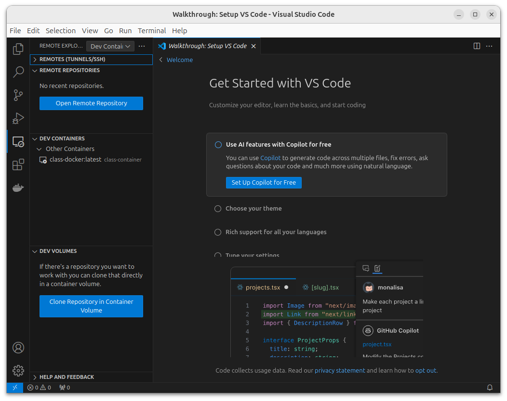
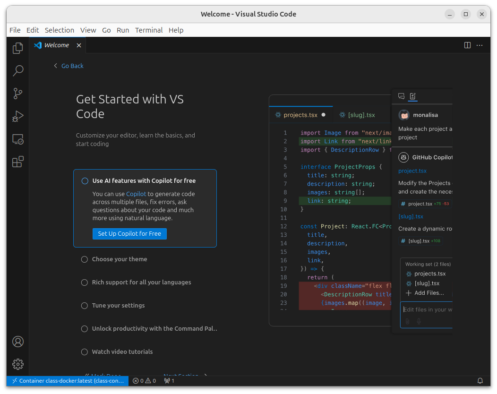
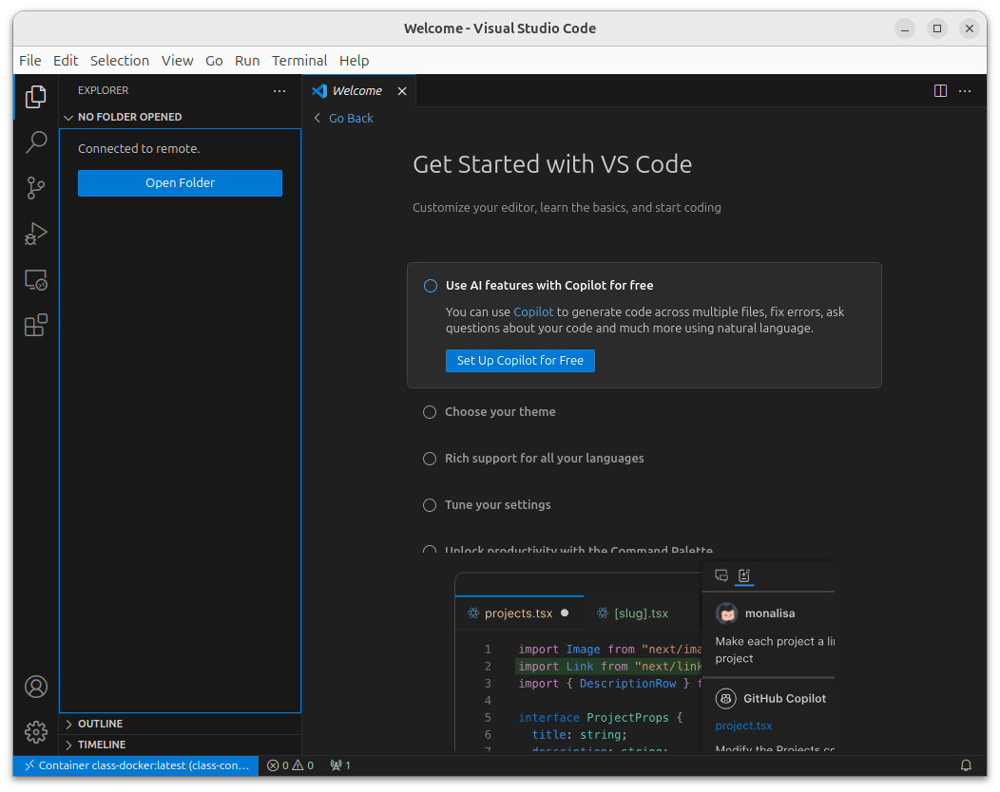
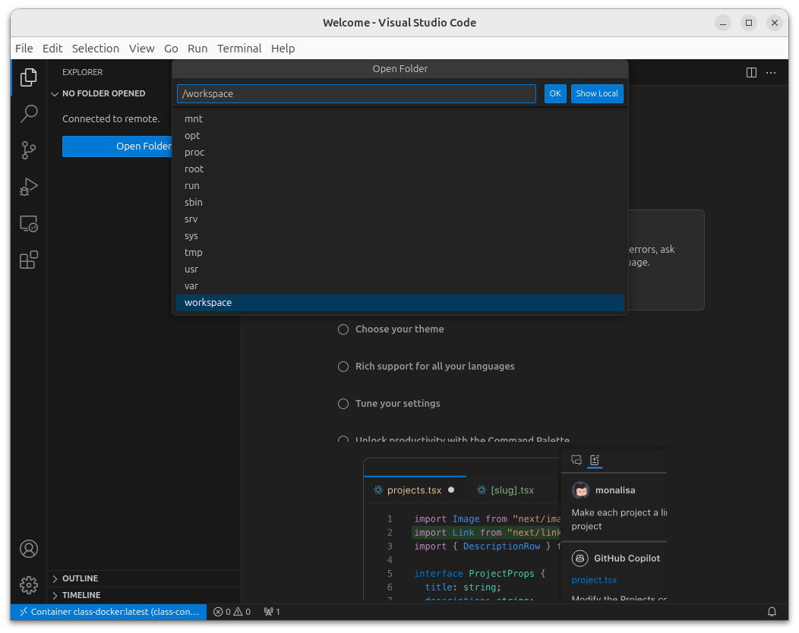

# Connecting VSCode to your Docker container

This guide will help you set up Visual Studio Code (VSCode) to connect to your running Docker container. This will allow you to edit and execute code inside the container seamlessly.

Later in the course, we will probably use Cursor instead of VSCode.

---

# Prerequisites

Before you begin, ensure that you have:

1. A **running Docker container** with SSH enabled.

   - Follow the steps in "Start the class Docker container"

2. **VSCode** installed on your computer.

   - Download it from [Visual Studio Code](https://code.visualstudio.com/).
   - Install the "Remote - SSH" and "Dev - Containers" extensions from the Extensions Marketplace.

---



---

# Connect using the Dev - Containers Extension

You can use the "Dev - Containers" extension to connect directly to the running container:

1. **Attach to the container**:

   - Press `Ctrl+Shift+P` (or `Cmd+Shift+P` on Mac) to open the command palette.
   - Type `Dev-Containers: Attach to Running Container` and select it.
   - Choose `class-container` from the list.

---



---



---

# Connect using the Dev - Containers Extension

2. **Open the workspace**:

   - VSCode will open a new window where you can find the container's `/workspace` directory.
   - You can now edit, debug, and execute code directly inside the container.
   - You will have to install other extensions as needed, such as the Python one and the Jupyter one.

---



---



---

# Test your setup

1. **Create a Python file**:

   - Inside the container, create a file named `test.py`:

     ```python
     print("Hello from Docker!")
     ```

2. **Run the file**:

   - Use the integrated terminal in VSCode to run:

     ```bash
     python3 test.py
     ```
   - Verify that the output is `Hello from Docker!`.

---

# Troubleshooting

1. **No container found**:

   - Verify the container is running using `docker ps`.

2. **VSCode cannot attach to container**:

   - Check that the "Remote - Containers" extension is installed.
   - Ensure Docker Desktop is running.

3. **Python not found**:

   - Verify Python is installed in the container:

     ```bash
     python3 --version
     ```

---

# Summary

This setup allows you to use a full-featured development environment while keeping your code and dependencies isolated in a container.

---

[← Previous](012-start-docker-container.md) · [Module 01](README.md) · [Course home](../../README.md) · [Next →](../02-version-control/021-bash-basics.md)

