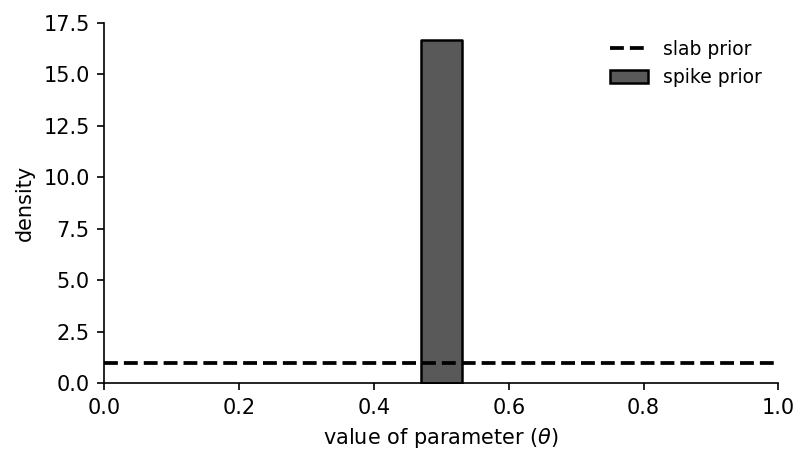
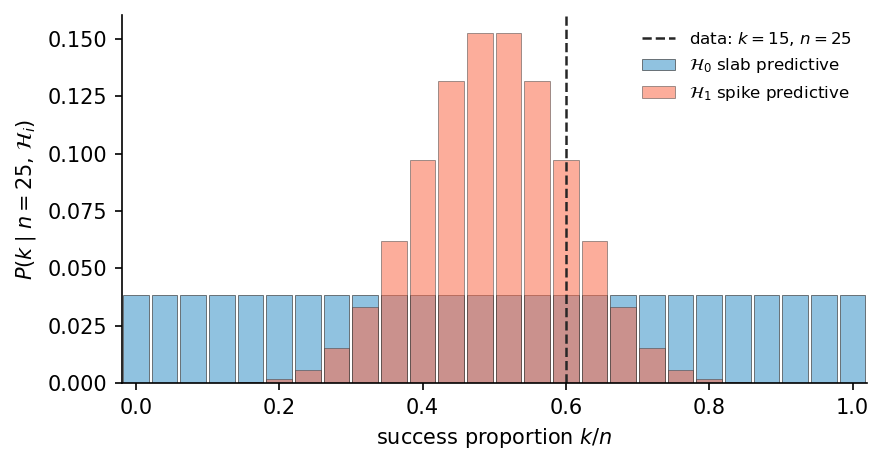

# Homework — Bayes factor test suite

## Purpose

Practice test-driven development by writing an elaborate test suite for a Bayes-factor object and a minimal working implementation.

## Background

Consider binomial data with $n$ trials and $k$ successes, and success probability $\theta$.

Two models differ by prior on $\theta$:

- slab prior: $\theta \sim U(0, 1)$
- spike prior: $\theta \sim U(a, b)$ (where $a$ and $b$ just above and just below the key value 0.5, e.g. $a = 0.4999$ and $b = 0.5001$)

The Bayes factor compares evidence:

- $B = \frac{p(k \mid \text{spike})}{p(k \mid \text{slab})}$

## Mathematical background

Notation and framing in this section follow Etz, Haaf, Rouder, and Vandekerckhove (2018).

Let the observed data be $x=(k,n)$ where $k$ is successes out of $n$ Bernoulli trials.

For a success-rate parameter $\theta$, the binomial sampling model is

$$
P(x\mid \theta)=\binom{n}{k}\theta^k(1-\theta)^{n-k}.
$$

### Hypotheses and priors

Define two hypotheses as models on $\theta$:

- $\mathcal{H}_0$ (slab): $\theta \sim U(0,1)$
- $\mathcal{H}_1$ (spike): $\theta \sim U(a, b)$ (take $a$ and $b$ from the running example in Etz et al., 2018)

So the corresponding prior densities are:

$$
p(\theta\mid \mathcal{H}_0)=1\ \text{on }[0,1],\qquad
p(\theta\mid \mathcal{H}_1)=\frac{1}{c}\ \text{on }[a,b].
$$



### Marginal likelihood and Bayes factor

For model $\mathcal{H}_i$, the model evidence is

$$
P(x\mid \mathcal{H}_i)=\int P(x\mid\theta)\,p(\theta\mid \mathcal{H}_i)\,d\theta.
$$

Define the Bayes factor favoring $\mathcal{H}_1$ over $\mathcal{H}_0$ as

$$
B_{1:0}=\frac{P(x\mid \mathcal{H}_1)}{P(x\mid \mathcal{H}_0)}.
$$

### Prior odds to posterior odds

Using the notation from the paper:

$$
\frac{P(\mathcal{H}_1\mid x)}{P(\mathcal{H}_0\mid x)} = \frac{P(\mathcal{H}_1)}{P(\mathcal{H}_0)}\times B_{1:0}.
$$

So $B_{1:0}$ is the multiplicative update from prior odds to posterior odds.

### Closed-form evidence for this pair

With the two uniforms above:

$$
P(x\mid \mathcal{H}_0)=\int_0^1 \binom{n}{k}\theta^k(1-\theta)^{n-k}\,d\theta,
$$

$$
P(x\mid \mathcal{H}_1)=\int_{a}^{b} \frac{1}{c}\,\binom{n}{k}\theta^k(1-\theta)^{n-k}\,d\theta.
$$

#### Integration in Python

To integrate a function in Python, you can use the `scipy.integrate.quad` function. We'll probably talk more about numerical integration later.

```python
import scipy.integrate

def integrand(self, x):
    return x * x

result = scipy.integrate.quad(integrand, 0, 1)
print(result)
```



### Useful smoke tests for your test suite

- If both models use the same prior, then $B_{1:0} = 1$.
- Evidence terms must be non-negative.
- Invalid inputs ($k>n$, negative counts, invalid $\theta$) should fail predictably.
- Design your own.

## Assignment constraints

- [ ] Use Python and `unittest`.
- [ ] Put tests in `tests/test_bayes_factor.py`.
- [ ] Put implementation in `bayes_factor.py`.
- [ ] Provide a **working implementation** of the `BayesFactor` class.
- [ ] The code does **not** need to be elegant, polished, or well-structured.
- [ ] Grading emphasis is on correctness and testing, not software style.

## Required Application Programming Interface (API) for the `BayesFactor` class

Implement a class named `BayesFactor` with at least the following methods (you may add more):

- constructor: `BayesFactor(n, k)`
- `likelihood(theta)`
- `evidence_slab()`
- `evidence_spike()`
- `bayes_factor()`

## What your tests must cover

### 1) Input and state validation

- [ ] Reject invalid `n` and `k` values (type and range checks).
- [ ] Reject impossible binomial states (e.g., `k > n`).
- [ ] Ensure object state is consistent after construction.

### 2) API behavior and return contracts

- [ ] Each required method exists and is callable.
- [ ] Methods return the expected data type/shape.

### 3) Mathematical consistency checks

- [ ] `likelihood(theta)` behaves sensibly at obvious points.
- [ ] `bayes_factor()` handles edge cases without crashing.
- [ ] Tests verify consistency between outputs and your documented mathematical choices.

### 4) Error behavior

- [ ] Invalid `theta` values are handled predictably.
- [ ] Impossible computations raise clear exceptions.
- [ ] Tests verify exception messages for multiple error cases.

### 5) TDD quality

- [ ] Tests are small, focused, and named clearly.
- [ ] Include at least one fixture or shared setup pattern.
- [ ] Include at least one intentionally failing test.

## Deliverables

Submit via GitHub, using the same repository as before, with the following files:

- `bayes_factor/tests/test_bayes_factor.py`
- `bayes_factor/bayes_factor.py` (working implementation with the required API)
- `bayes_factor/Dockerfile` to create a Docker image that supports your code
- `bayes_factor/README.md` (with not too much detail, just how to run the tests)

## Citation

Etz, A., Haaf, J. M., Rouder, J. N., & Vandekerckhove, J. (2018). Bayesian inference and testing any hypothesis you can specify. *Advances in Methods and Practices in Psychological Science, 1*(2), 281-295. https://doi.org/10.1177/2515245918773087
