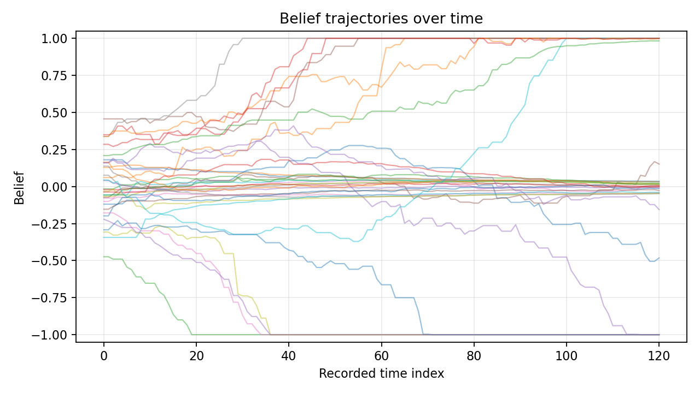
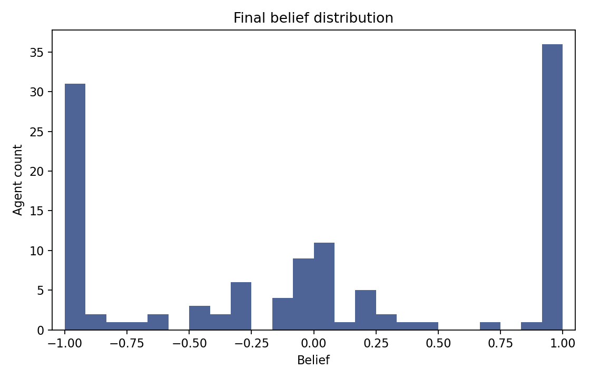
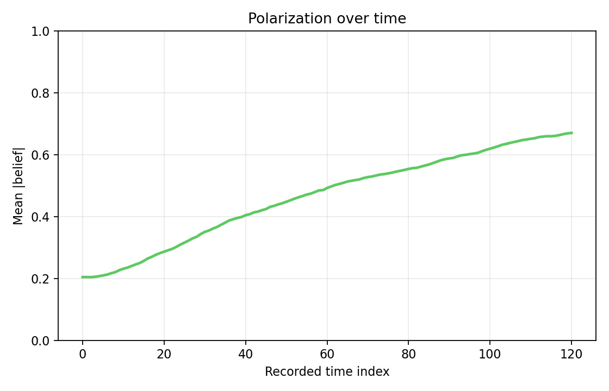
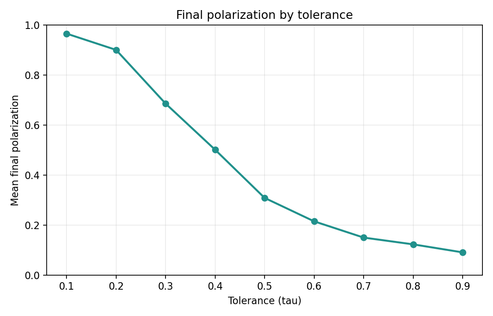

# Agent-based modeling as generative explanation

Growing macro-patterns from micro-level cognitive rules

---

# From controlled delegation to scientific modeling

In the previous lecture, the core problem was workflow control:

- define the goal
- constrain the implementation
- verify the result

ABM gives us a modeling problem where that discipline matters immediately.

---

# Classical cognitive modeling

Cognitive models describe how one person:

- forms beliefs
- updates on evidence
- makes decisions under uncertainty

This is one standard level of analysis in cognitive science.

---

# The gap

Many phenomena of interest are not properties of a single mind.

- Why do populations polarize even when individuals reason well?
- Why do norms emerge and persist without central enforcement?
- Why do crowds sometimes find good solutions and sometimes fail?

A single-agent model can specify the cognitive mechanism, but it cannot by itself explain the population-level pattern.

---

# An illustrative question

How can population-level polarization emerge even when individuals only make small, locally reasonable belief updates?

We will treat this as a generative question, not a correlational one.

---

# Why ABM?

- A standard cognitive model asks how one person updates.
- An ABM asks what many interacting updaters produce together.
- ABM embeds cognitive mechanisms inside an interaction structure.

---

# What is an agent?

An agent is a simplified decision-maker with internal state, local inputs, and update rules.

- State changes over time.
- Rules map local inputs to local actions.

---

# Agent state examples

- belief
- memory
- attention
- confidence
- strategy
- preference
- location
- social ties

---

# What is an agent-based model?

An agent-based model is a computational model in which possibly heterogeneous agents update their states through local rules while interacting with each other or with an environment.

Components:

- agents and their states
- update rules
- environment and interaction structure
- update schedule
- macro-level outcomes

---

# Intellectual lineage

- Schelling (1971): residential segregation from mild local preference
- Axelrod (1984): cooperation from iterated local interaction
- Epstein and Axtell (1996): *Growing Artificial Societies*
- Epstein (1999): "If you didn't grow it, you didn't explain it"

In cognitive science, ABM connects naturally to social learning, cultural evolution, and language emergence.

---

# ABM as generative explanation

To explain a macro-pattern, grow it from micro-level rules.

1. Specify agents and their states.
2. Specify interaction and update rules.
3. Run the system.
4. Check whether the target pattern appears.

The explanatory claim is mechanism-level sufficiency.

But ABM does not license simple inverse inference: the same macro-pattern can arise from different micro-mechanisms.

---

# Emergence

A pattern is **emergent** when it appears at the population level even though no individual agent represents, intends, or directly controls that pattern.

- Each agent: a simple belief-update rule, nothing more.
- Population: a bimodal distribution of beliefs develops.

Emergence is the central explanandum of ABM.

---

# ABM and statistical models answer different questions

- Statistical model: which variables predict observed outcomes?
- Cognitive model: what mechanism describes one agent?
- ABM: what happens when many such mechanisms interact?

Good practice triangulates across all three.

---

# Why cognitive scientists should care

- cultural transmission
- social learning
- collective intelligence
- polarization
- language emergence
- developmental systems
- cognitive ecology

---

# What makes an ABM cognitive?

An ABM becomes a cognitive-science model when the agent rule represents a theory of cognition.

- belief updating
- memory retrieval
- attention allocation
- reinforcement learning
- categorization
- decision thresholds
- confidence-weighted learning

The population model is only as cognitive as the agent model.

---

# Toy model or empirical model?

**Toy ABM:**

- asks whether a mechanism *could* generate a pattern
- emphasizes conceptual clarity
- uses stylized assumptions

**Empirical ABM:**

- constrains rules from data
- compares simulated and observed patterns
- treats validation as part of the model

Here we will build a toy model explicitly.

---

# Design checklist for ABM studies

1. target phenomenon
2. agent-level mechanism
3. interaction mechanism
4. update schedule
5. outcome measure
6. sensitivity analysis
7. comparison model
8. validation target

---

# Running example: belief polarization

Research question:

Can population-level polarization emerge from simple local social influence?

Belief state: `b_i in [-1, 1]`

- `-1`: strong belief in position A
- `0`: neutral
- `+1`: strong belief in position B

---

# Environment and interaction structure

We use a ring network.

- each agent has two neighbors
- interaction is local
- no global observer

The ring is deliberately unrealistic; it makes locality transparent.

---

# Ring schematic

```text
0 -- 1 -- 2 -- 3 -- ... -- N-1
|                         |
+-------------------------+
```

Local edges constrain who can influence whom.

---

# Update schedule

**Synchronous**: all agents update simultaneously each step.

**Asynchronous**: one agent is chosen per step (random or sequential).

The choice changes dynamics and is often under-reported -- it is part of the model specification.

---

# Cognitive updating rule

At each step:

1. choose one focal agent
2. choose one neighbor
3. compare beliefs
4. assimilate if similar
5. contrast if dissimilar

---

# Mathematical rule

```text
if |b_i - b_j| < tau:
    b_i <- b_i + alpha * (b_j - b_i)
else:
    b_i <- b_i - beta  * (b_j - b_i)
clip b_i to [-1, 1]
```

---

# Parameter interpretation

- `alpha`: assimilation rate
- `beta`: contrast rate
- `tau`: tolerance threshold

These parameters define the cognitive-social mechanism.

---

# Before coding, write the scientific contract

For this model, we need to specify:

- research question
- agent state variables
- interaction topology
- update rule and schedule
- outcome metrics
- expected qualitative behavior
- verification checks

This is the same planning discipline we use with Cursor.

---

# Python architecture

- initialize agents and beliefs
- define ring neighbors
- implement `step()` update
- run simulation and record history
- compute outcome measures

---

# Minimal class outline

```python
class BeliefPolarizationABM:
    def __init__(...): ...
    def neighbors(self, i): ...
    def step(self): ...
    def run(self, ...): ...
```

---

# Minimal step() excerpt

```python
difference = self.beliefs[j] - self.beliefs[i]
if abs(difference) < self.tolerance:
    self.beliefs[i] += self.alpha * difference
else:
    self.beliefs[i] -= self.beta * difference
self.beliefs[i] = np.clip(self.beliefs[i], -1, 1)
```

---

# Implementation choices

- NetLogo: visual and educational; widely used in ABM
- Mesa: Python ABM framework; integrates with NumPy, pandas, and matplotlib
- AgentPy: lightweight Python option; useful for parameter sweeps
- Plain Python: best here because every line of the mechanism stays visible

---

# Outcome measures

- mean belief
- variance
- polarization: mean `|b_i|`
- extreme share: proportion near `-1` or `+1`
- optional cluster count

---

# Verification checks for this model

Useful checks include:

- beliefs always remain in [-1, 1]
- the same seed reproduces the same trajectory
- no-interaction or no-contrast variants behave as expected
- output files are created in the expected folder
- parameter sweeps summarize multiple seeds, not one run

---

# Individual trajectories



---

# How to read trajectories

- agents start near the center
- local updates amplify differences
- repeated interaction can separate groups

---

# Final distribution



Interpretation: the macro-pattern is a distributional property, not an individual-level state.

---

# Polarization over time



Interpretation: polarization increases as repeated local interaction accumulates.

---

# What emerged?

- No agent tries to polarize the population.
- Each agent applies a local update rule.
- The population distribution changes shape because local updates accumulate over time.

---

# One run is not the result

ABMs often include stochastic elements:

- initial beliefs
- selected agents
- selected neighbors
- update order
- random seeds

Analyze the distribution over runs, not one trajectory.

---

# Sensitivity analysis is required

One run is a demonstration, not evidence of a robust mechanism.

- vary tolerance
- vary contrast strength
- vary network structure
- vary random seed

---

# Parameter sweep over tolerance



---

# Comparison models to run

- assimilation only (no contrast)
- contrast only (no assimilation)
- random mixing (no network structure)
- ring vs small-world network
- heterogeneous tolerance
- external evidence source

---

# Methodological risks: construction

- arbitrary rule choices
- under-reported update schedule
- sensitivity to implementation details
- too many free parameters

---

# Methodological risks: interpretation

- equifinality (different mechanisms produce the same macro-pattern)
- weak empirical grounding
- no serious baseline comparisons
- overclaiming generality from a toy model

---

# What data constrain the model?

Empirical data should constrain:

- agent-level update rule
- interaction network structure
- time scale of updating
- macro-pattern target

---

# What would count as failure?

The model fails if:

- polarization appears only for one random seed
- results vanish under plausible parameter ranges
- a simpler model produces the same pattern
- macro-patterns match but micro-dynamics are wrong
- the update rule contradicts empirical behavioral data

---

# ABM in cognitive science

ABM does not replace cognitive modeling.

ABM helps cognitive scientists ask whether a proposed cognitive mechanism, when embedded in an interaction structure, is *sufficient* to generate a population-level phenomenon.

---

# Final assignment

You will build a small ABM that includes:

- one research question with a testable hypothesis
- a reproducible run script
- simulation-specific verification
- explicit agent rules

Next week you will give a 5-10 minute presentation of your proposed project.

We can all chime in on your project ideas and help you refine a research question.

ABM tests whether a proposed cognitive mechanism, embedded in an interaction structure, is sufficient to generate a target population-level phenomenon.

---

# References

Axelrod, R. (1984). *The evolution of cooperation*. Basic Books.

Epstein, J. M. (1999). Agent-based computational models and generative social science. *Complexity*, *4*(5), 41-60. https://doi.org/10.1002/(SICI)1099-0526(199905/06)4:5<41::AID-CPLX9>3.0.CO;2-F

Epstein, J. M., & Axtell, R. L. (1996). *Growing artificial societies: Social science from the bottom up*. The MIT Press. https://doi.org/10.7551/mitpress/3374.001.0001

Schelling, T. C. (1971). Dynamic models of segregation. *Journal of Mathematical Sociology*, *1*(2), 143-186. https://doi.org/10.1080/0022250x.1971.9989794

---

[<- Previous](082-cursor-overview.md) . [Module 08](README.md) . [Course home](../../README.md)
